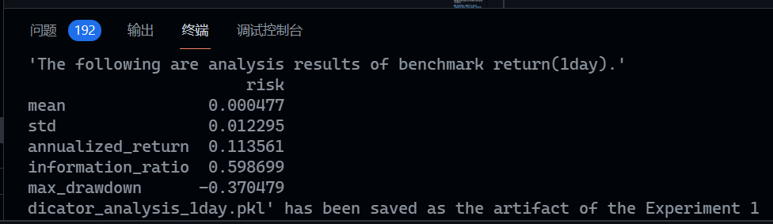
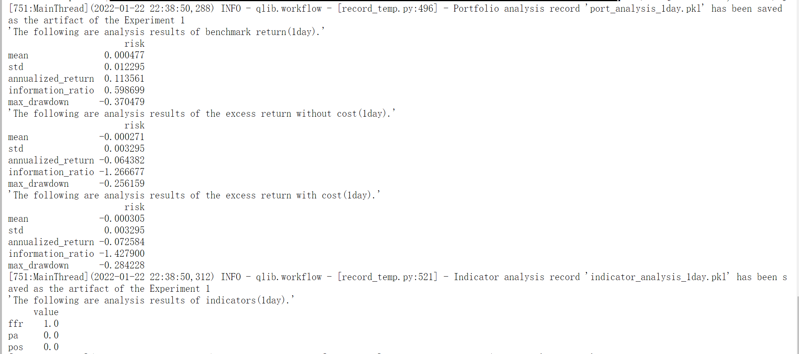
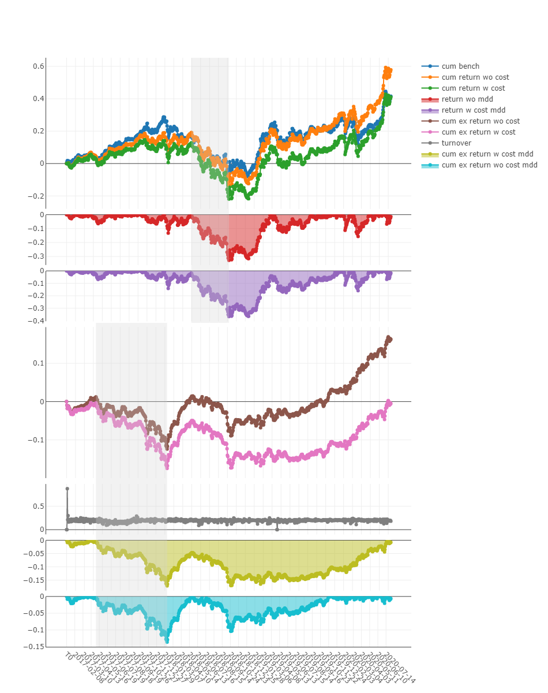
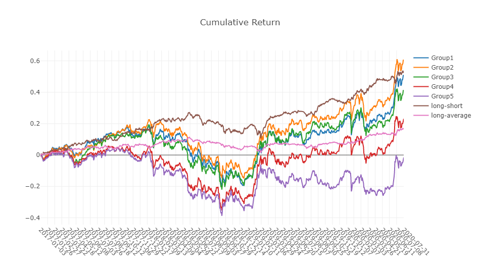
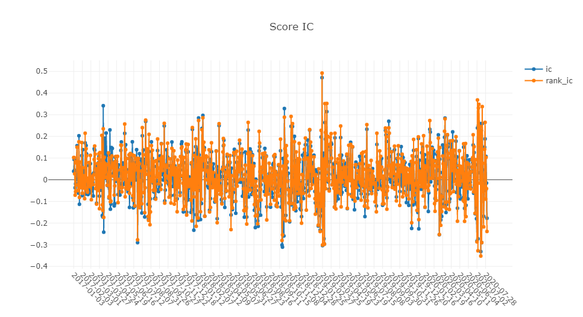
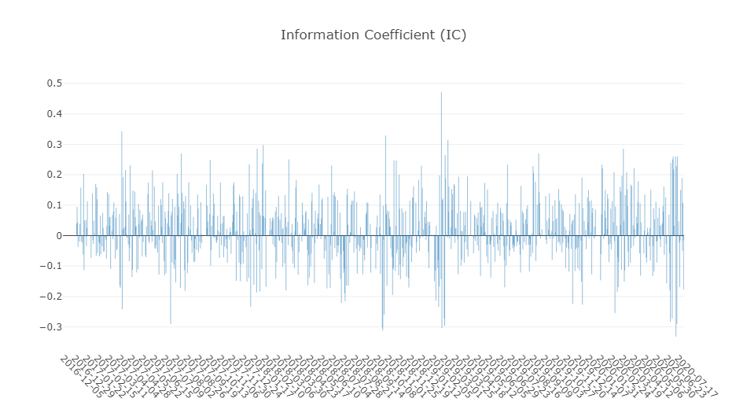

# qlib-CNN

Qlib 依赖版本：0.8.3

## 运行范例

直接运行范例代码，得到结果。

```
python task1/workflow_by_code.py
```



## pytorch 实现 CNN

基础版本的CNN论文展现了下面的三层卷积网络。


但是对于一维卷积网络来讲，删去了 Pooling 层，并采用 padding 的方式保证数据维度一致。更好的优化需要使用 TCN 模型做多层卷积，使用因果卷积 Chomp1d。

首先需要运行 [数据获取](task2/get_data.ipynb) 的代码。

[代码](task2/pytorch_cnn.py) 为 CNN 的实现情况，层由 `layers` 定义。运行时需要将其移入 qlib 包的 `qlib/contrib/model/` 中，训练框架参考 [pytorch_nn](https://github.com/microsoft/qlib/blob/main/qlib/contrib/model/pytorch_nn.py)。

使用
```cmd
qrun task2/workflow_config_cnn_Alpha158.yaml
qrun task2/workflow_config_cnn_Alpha360.yaml
```
运行模型。

使用含有 RTX 3080 Ti 的服务器上运行该模型，结果如下：



### 分析

TCN 已经被[实现](https://github.com/microsoft/qlib/blob/main/qlib/contrib/model/pytorch_tcn_ts.py)，参照对应的 [YAML 文件](task3/workflow_config_tcn_Alpha158.yaml)，将尝试直接运行该模型。由于本地算力不足，使用 Google Colab 运行之见 [代码](task3/workflow_tcn.ipynb)。

> `TSDatasetSampler` 近期有 API 变动，需要手动进行数据转换（已经进行 Issue [评论](https://github.com/microsoft/qlib/issues/411#issuecomment-993484655)）。







