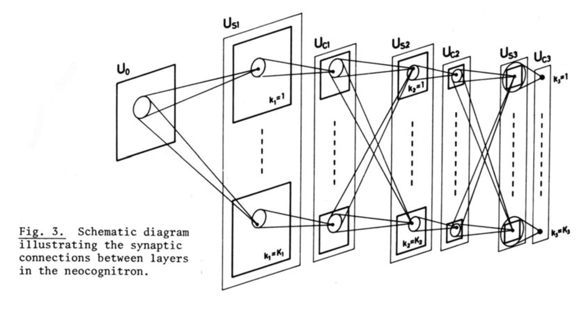

# qlib-CNN

## 运行范例


## pytorch 实现 CNN

基础版本的CNN论文展现了下面的三层卷积网络。



首先需要运行 [数据获取](task2/get_data.ipynb) 的代码。

[代码](task2/pytorch_cnn.py) 为 CNN 的实现情况，层由 `layers` 定义。运行时需要将其移入 qlib 包的 `qlib/contrib/model/` 中，训练框架参考 [pytorch_nn](https://github.com/microsoft/qlib/blob/main/qlib/contrib/model/pytorch_nn.py)。

使用
```cmd
qrun task2/workflow.yaml
```
运行模型，该 yaml 文件参考了 [MLP](https://github.com/microsoft/qlib/blob/main/examples/benchmarks/MLP/workflow_config_mlp_Alpha158.yaml)。

GTX 1050 Ti 的显存大小不足以运行该 CNN 模型代码，需要使用更高显存的 GPU。

### 分析

由于 TCN 已经被[实现](https://github.com/microsoft/qlib/blob/main/qlib/contrib/model/pytorch_tcn_ts.py)。运行之见 [代码](workflow.ipynb)。